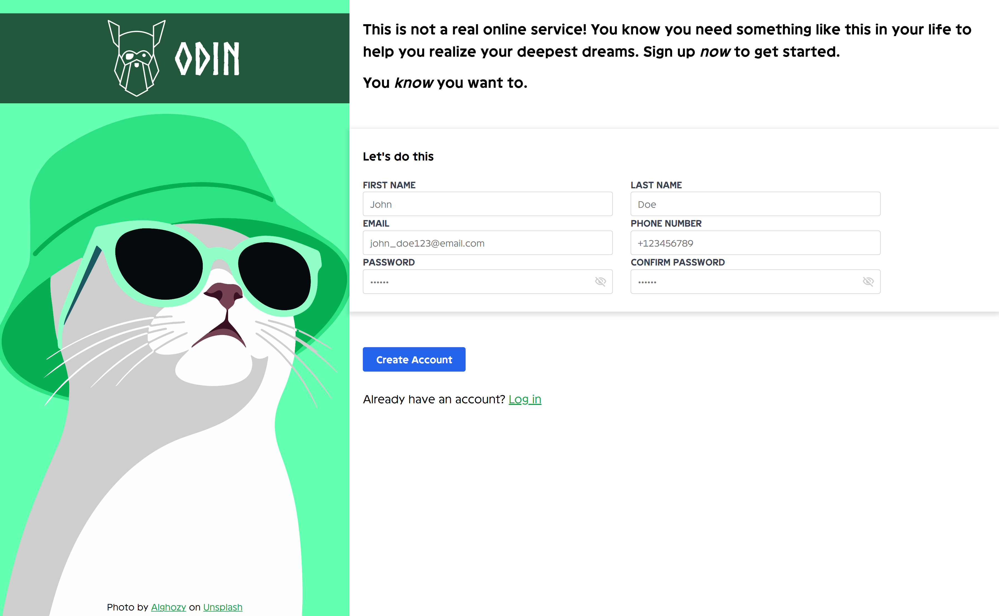
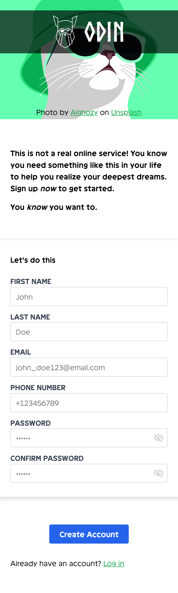

# The Odin Project - Project: Sign-up Form

This is a solution to the [Project: Sign-up Form](https://www.theodinproject.com/lessons/node-path-intermediate-html-and-css-sign-up-form).

## Table of contents

- [The Odin Project - Project: Sign-up Form](#the-odin-project---project-sign-up-form)
	- [Table of contents](#table-of-contents)
	- [Overview](#overview)
		- [Introduction](#introduction)
		- [Screenshot](#screenshot)
		- [Links](#links)
	- [My process](#my-process)
		- [Built with](#built-with)
		- [What I learned](#what-i-learned)
			- [HTML](#html)
			- [CSS](#css)
			- [User Experience](#user-experience)
			- [Problem Solving](#problem-solving)
		- [Useful resources](#useful-resources)
		- [AI Collaboration](#ai-collaboration)
	- [Author](#author)
	- [Acknowledgments](#acknowledgments)

## Overview

### Introduction

This project is intended to give you a chance to flex some of the new items you’ve been absorbing over the past few lessons. This time it’s a sign-up form for an imaginary service.

### Screenshot

**Screenshot desktop version**


**Screenshot mobile version**


### Links

- Solution URL: [Solution](https://github.com/AzamAzis/Project-Sign-up-Form)
- Live Site URL: [Live site](https://azamazis.github.io/Project-Sign-up-Form/)

## My process

### Built with

- Semantic HTML5 markup
- CSS custom properties
- Flexbox
- Mobile-first workflow

### What I learned

This project helped reinforce my understanding of HTML forms.

#### HTML

- Created accessible form using semantic HTML.
- Used proper types (`text`, `tel`, `password`).
- Applied built-in HTML validation with:
  - `required`
  - `pattern`
  - `autocomplete`
  - `inputmode`
  - `minlength`
  - `min`
- Associated every input with its corresponding `<label>` for better accessibility

```html
<label class="form__label" for="first_name">First name</label>
<input
  class="form__input"
  id="first_name"
  name="first_name"
  autocomplete="given-name"
  inputmode="text"
  maxlength="120"
  pattern="[A-Za-z]{1, 120}"
  placeholder="John"
  required
  type="text" />
```

#### CSS

- Build a two-column layout using flexbox.
- Customize input state with pseudo classes
  - `:focus`
  - `:user-invalid`
  - `:user-valid`

```css
.form__input:user-invalid {
  border-color: var(--color-input-invalid);
}
```

#### User Experience

- Added clear visual feedback for valid and invalid inputs.
- Added placeholder

#### Problem Solving

- Practice debugging complex CSS layouts.
- Learned how different validation attributes interact.
- Improve my understanding of regex patterns for form inputs

### Useful resources

- [How to validate forms?](https://threadreaderapp.com/thread/1400388896136040454.html) - This helped me to decide validation form design. I really liked this pattern and will use it going forward.

### AI Collaboration

I used Claude to generate custom properties.

## Author

- GitHub - [@AzamAzis](https://github.com/AzamAzis)
- Twitter - [@AzamAzis01](https://x.com/AzamAzis01)

## Acknowledgments

Background photo by [Alghozy](https://unsplash.com/illustrations/a-cat-wearing-a-green-bucket-hat-and-sunglasses-YdnvVsFQOHc)
